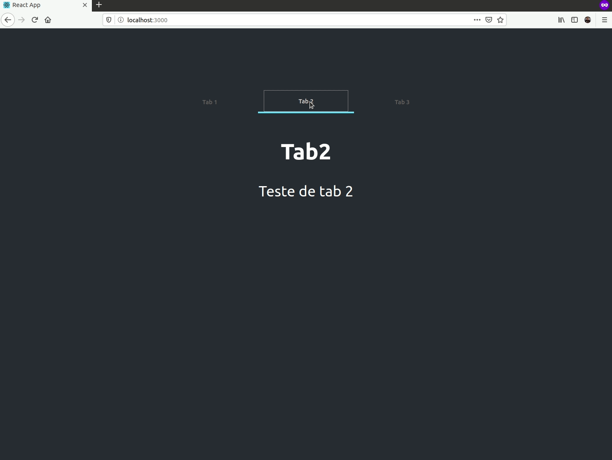

# Tabs Component Example with Context API

Example how to make a tab component with context API using Typescript

<h1 align="center">

</h1>

## Getting Started

### `yarn`

To install all dependencies

- this example was bootstrapped with [Create React App](https://github.com/facebook/create-react-app);
- use [Styled-Components](https://styled-components.com/) to add style, and also;
- use [Polished](https://github.com/styled-components/polished) - only for shade.

### `yarn start`

Runs the app in the development mode. 
Open [http://localhost:3000](http://localhost:3000) to view it in the browser.

## Authors

- **[Moura Braz](mailto:cmourabraz@gmail.com)**

## License

This project is licensed under the MIT License - see the [LICENSE.md](LICENSE.md) file for details
